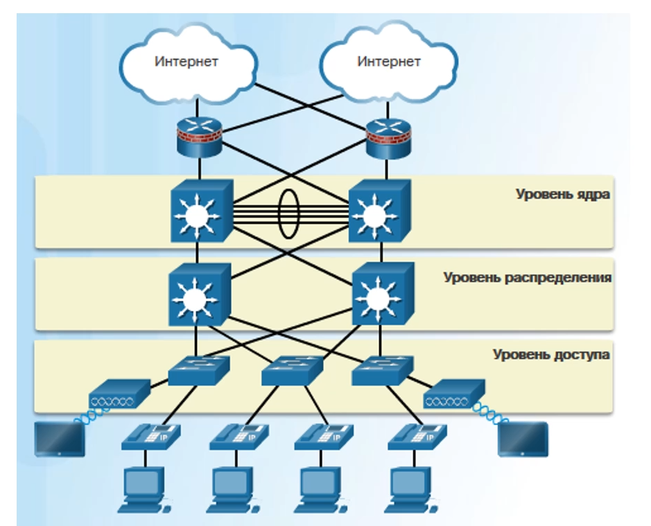
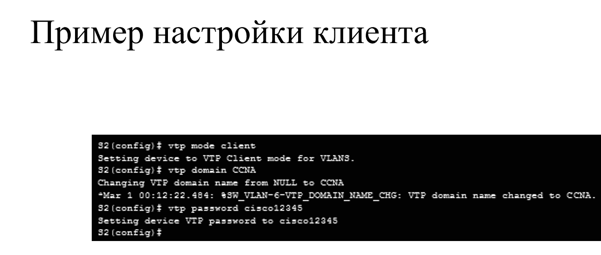

# Необходимость масштабирования

* Когда в организации появляется большое кол-во сотрудников, техники, то сеть организации должна **масштабироваться**, т.к требуется больше сетевых ресурсов, а также требуется обеспеение бесперебойной работы сети

Надежные, Доступные и масштабируемые сети можно строить с помощью **Иерархической модели** (см прошлый сем)

### 3х уровневая модель

* если есть другие филиалы

### 2х уровневая модель(Уровень распределения и уровень ядра схлопнулись)

* если мало денег, либо мало сотрудников(филиалов)

# Требования к масштабируемости

## Рекомендации
* Выбор оборудования с расширяемыми модулями
* Иерархическая модель
* Иерархическая адресация(позволяет масштабировать сети за счёт иерархии)
* Фильтрация трафика с помощью маршрутизаторов

## Оптимизация
* Резервные каналы связи
* Технология EtherChannel
* Иерархический протокол маршрутизации(позволяют более оптимально работать в больших сетях)
* Подключение беспроводных клиентов(обеспечивают высокую доступность)

# Резервирование 

Для резервирования можно
* Дублировать оборудование и каналы
  * Его можно настроить в двух режимах:
    1. Оборудование включается в сеть в случае поломок и неисправностей
    2. Трафик распределяется между оборудованием, за счёт чего происходит уменьшение нагрузки на отдельные экземпляры оборудования
    
* Дублировать софт
  * Можно дублировать софт, который определяет работу сервера(его конфиг и необходимые для работы данные)
  * В случае сбоя софта можно заменить нерабочую версию софта на рабочую, либо распространить рабочий софт на другие сервера

# Сегментирование сети

* Можно эффективно изолировать участки сети, в которых могут случиться сбои. В таком случае, если произайдёт сбой, то пострадает только один сегмент сети, а не вся сеть

* Сегментирование Локализует проблему на уровне сегмента

* Также на уровне сегмента происходит изоляция трафика

# Увеличение пропускной способности 

* чаще пропускную способность увеличивают между уровнями доступа и распределения, т.к именно тут происходит агрегация трафика пользователей
* Агрегация каналов между уровнями доступа и распределения 
* [EtherChannel](https://en.wikipedia.org/wiki/EtherChannel)
* Использование оборудования, обладающего более большой пропускной способностью

# Беспроводные локальные сети

* Это удобнее, чем подключать клиента к коммутатора напрямую

# Выбор протокола маршрутизации

* нужен более эффективный протокол маршрутизации, т.к становится больше сетевых устройств и каналов связи, между которыми нужно обеспечить доступ

* [OSPF](https://ru.wikipedia.org/wiki/OSPF)

* Необходимо правильно назначать адреса, чтобы трафик не ходил там где не надо

# Выбор оборудования

**более подробно про оборудование смотри 6 сем**

Есть коммутаторы 3 и 2ого уровня

* L3 коммутатор ставится на уровне распределения и ядра. Также там можно поставить маршрутизатор

* L2 коммутатор ставится на уровне доступа

На уровень распределения и ядра нужно ставить устройства с высоким уровнем надежности

**Про фиксированные и модульные коммутаторы есть в 6ом семе
**

**Про маршрутизаторы тоже есть в 6ом семе** 

маршрутизаторы ставятся на уровне ядра или на границах сетей

# Лицензирование

Всё оборудование СISCO работает на ОС IOS

Оборудование поставляется с базовой версией ОС, остальные функции требуют дополнительной лицензии

# Управление оборудованием

Можно управлять 2мя способами:
* Внеполосный
  * первый этап настройки оборудования с использованием консоли
* Внутриполосный
  * Настройка оборудования по сети (по telnet, http, ssh)
  * Нужно обеспечить безопасность трафика, который направлен на управление оборудованием
  * также у L2 коммутаторов нужно предварительно настраивать внутриполосную маршрутизацию перед настройкой

# Комутация третьевого уровня

* Многоуровневые коммутаторы **обеспечивают высокую скорость обработки пакетов**, используя аппаратную коммутацию

* Типы интерфейсов 3его уровня
  * Маршрутизируемый порт - интерфейс 3его уровня
  * Виртуальный интерфейс коммутатора (SVI) - виртуальный интерфейс для маршрутизации между сетями VLAN

* Все коммутаторы Cisco Catalyst 3его уровня поддерживают протоколы маршрутизации, но некоторые модели коммутаторов требуют ПО с расширенными возможностями для активации отдельных функций протоколов маршрутизации

* Маршрутизируемые порты обычно внедряются между уровнями распределения и ядра 

# Маршрутизация по SVI

**Было в лекциях 6ого сема**
* SVI-это виртуальный интерфейс, настраиваемый в многоуровневом коммутаторе:
  * обеспечение шлюза для сети VLAN с целью маршрутизации трафика по направлению к виртуальной сети VLAN или из неё
  * Обеспечение на коммутаторе IP подключения 3го уровня
  * Поддержка конфигураций протокола маршрутизации и режима моста

* Преймущества SVI
  * Быстрее чем router on a stick (было в леккциях 6ого сема)
  * Для маршрутизации не требуются внешние каналы от коммутатора к маршрутизатору
  * Не ограничивается одним каналом, для увеличения пропускной способности можно использовать EtherChannel 2ого уровня

# Маршрутизируемые порты

* Маршрутизируемый порт является физическим портом, работающим аналогично интерфейсу маршрутизатора
  * Не связан с определенной виртуальной локальной сетью(VLAN)
  * Не поддерживает подинтерфейсы

* Первоначально маршрутизируемые порты настраиваются между коммутаторами на уровнях ядра и распределения

* Для настройки маршрутизируемого порта необходимо выполнить команду `no switchport interface` на соответствующем порту

* Только на L3 коммутаторах

# Поиск и устранение неисправностей

Для поиска и устранения неполадок L3 коммутации проверьте

* Правильность настроек сетей VLAN 

* Интерфейсы SVI - проверка правильности IP адреса, маски подсети и номера сети VLAN

* Маршрутизация - проверка правильности настройки и включения статической или динамической маршрутизации

* Хосты - проверка правильности IP адреса маски подсети и шлюза по умолчанию

# Работа с VLAN
Смотри 6 сем по VLAN

## Протокол VTP - VLAN Trunking Protocol

При создании масштабируемой сети, важно подключать новых клиентов и оборудование таким образом, чтобы новые настройки были согласованы со старыми. Задача может быть сложной при большом размере сети

VTP - может облегчить процесс настройки

VTP - это клиент серверный протокол

## Компоненты VTP

**Домен VTP**
* Состоит из одного или нескольких соединенных между собо коммутаторов
* У домена VTP только одно имя(регистрозависимое)
* Все коммутаторы в домене обмениваются конфигурациями VLAN с помощью объявлений VTP
* Коммутаторы из разных доменов VTP VTP сообщениями не обмениваются
* Граница домена проходит по маршрутизатору или коммутатору L3

**Объявления VTP**

* каждый коммутатор в домене VTP переодически отправляет глобальные объявления с конфигурацией из каждого порта транка на зарезервированный групповой адрес

* Соседние коммутаторы получают эти объявления и при необходимости обновляют свою конфигурацию VTP и сети VLAN

**Режимы VTP**
* **По умолчанию все коммутаторы работают в режиме сервера**
* Коммутатор можно настроить в одном из трех режимов VTP: 
1. **Серверный режим**:
   1. Сервер VTP объявляют информацию о сетях VLAN домена VTP для других коммутаторов с поддержкой VTP, расположенных в том же домене VTP
   2. Серверы VTP хранят информацию о сетях VLAN для всего домена в NVRAM
   3. Коммутаторам, настроенным как серверы VTP разрешено создавать, удалять и переименовывать сети VLAN для домена
   
2. **Клиентский режим**
   1. Клиенты VTP работают так же, как и серверы VTP, но на клиенте VTP нельзя создавать, изменять и удалять сети VLAN
   2. Клиент VTP сохраняет информацию о сетях VLAN для всего домена, только пока коммутатор работает
   3. При сбросе коммутатора информация о сети VLAN удаляется, т.к информация хранится в энергозависимой памяти
   4. Необходимо настроить режим клиента VTP на коммутаторе
   
3. **Прозрачный режим**
   1. Коммутаторы в прозрачном режиме не участвуют в работе VTP(не применяют настройки VTP сервера). Они лишь пересылают объявления VTP клиентам и серверам VTP
   2. Сети VLAN, созданные, переименованные или удаленные на коммутаторах в прозрачном режиме, будут локальными только для этих коммутаторов. Т.е инфа о таких VLAN никуда передана не будет.
   3. Чтобы создать сеть VLAN расширенного диапозона, необходимо настроить коммутатор в прозрачном режиме VTP
   
**Пароль VTP**

* Для коммутаторов в домене VTP также можно задать пароль. Устройства будут принимать данные от сервера VTP при условии, что пароль и имя сервера совпадают

## Сообщения VTP

S1-сервер
S2-клиент

* если на S1 произошли изменения, то он рассылает `VTP Summary Advertisment` по сети в пределах домена. В cообщении указывается номер ревизии, версии VLAN конфига
  * **Вообще рассылает по всей сети, но клиенты, у которых имя домена не совпадает с доменом сервера, игнорируют это сообщение**
  * При изменении номер ревизии увеличивается на 1

* Получив сообщение, S2 сравнивает свои и полученный из сообщения номера ревизии.
  * Если номер ревизии из сообщения больше, то S2 отправляет S1 запрос на получение нового конфига
  * Запрос называется `VTP Advertisment Request`

* После получения сообщения Request от S2, S1 рассылает сообщение `VTP Subset Advertisment`, в котором содержится вся инфа, необходимая для применения изменений.

Получив `VTP Subset Advertisment`, S2 применяет изменения, описанные в сообщении, а затем увеличивает номер ревизии локально 

## Версии VTP

1. **Версия 1**
   1. Режим VTP по умолчанию на всех коммутаторах
   2. Поддерживает только сети VLAN в **стандартном диапозоне**

2. **Версия 2**
   1. Поддерживает только сети VLAN в **стандартном диапозоне**
   2. Поддерживает традиционные сети Token Ring
   3. поддерживает расширенные функции, включая нераспознанный TLV, прозрачный режим, зависящий от версии, а также проверки согласованности

3. **Версия 3**
   1. не рассматривается

## Show vtp status

**Настройки VTP**

## Предосторожности при использовании VTP

Допустим мы хотим добавить в сеть коммутатор S4, но этот коммутатор уже раньше работал в какой-то сети. Если у этого коммутатора S4 и остальных коммутаторов совпадут названия доменов, то может получиться так, что у коммутатора номер ревизии окажется больше чем номер ревизии у остальных коммутаторов в текущей сети

Если этот коммутатор S4 будет работать в режиме сервера, т.к у него номер ревизии больше, то он разошлёт обновления всем коммутаторам, которые будут приняты остальными коммутаторами(номер же больше) и это может испортить доступ клиентов к сети, т.к старая настройка VLAN будет заменена на настройку этого коммутатора S4

Коммутаторы-Серверы также примут эту настройку 

Таким образом нужно внимательно подключать новый коммутатор:
* сбросить старые настройки VLAN
* Сбросить номер ревизии

Чтобы сбросить номер ревизии можно:
* Поменять название домена на несуществующее и затем вернуть имя обратно 
* поменять режим на прозрачный, а затем настроить на нужный режим: Клиент или сервер 

## Настройка VTP

имя домена нужно задавать на каждом свитче вручную

**имя домена регистрозависимое**

После настройки VTP на сервере можно создавать VLAN

**проверка настроенных VLAN**

## Типы VLAN

**Виртуальные локальные сети стандартного диапозона**
* Использование в малых и средних сетях предприятий и организаций
* Определяются идентификаторами VLAN от 1 до 1005
* идентификаторы 1, 1002, 1003, 1004, 1005 создаются автоматически и не могут быть удалены.
  * 1002, 1003, 1004, 1005 - резервируются для VLAN сетей типа Token Ring и FDDI
* Конфигурации сохраняются в файле бд VLAN vlan.dat, который хранится во флеш-памяти

**Сети VLAN расширенного диапозона**
* **VTP не работает с VLAN расширенного диапозона**
* Используются операторами связи и крупными организациями с целью расширить свою инфраструктуру для большего числа заказчиков
* Определяется идентификаторами от 1006 до 4096
* Поддерживают меньше функций VLAN, чем сети VLAN стандартного диапозона
* Конфигурации сохраняются в файле текущей конфигурации

Чтобы смочь добавлять VLAN из расширенного диапозона, нужно поменять режим работы коммутатора на прозрачный

## Поиск и устранение неисправностей в VTP

* Несовместимые версии VTP. 
  * **Версии vtp должны быть одинаковыми**
* Проблемы с паролем
* Неверное имя домена
* Все коммутаторы настроены в режиме клиента
* Неправильный номер ревизии

**Изменения между коммутаторами передаются, елси настроены транк порты**

VTP - может быть неудобен, **т.к порты придётся порты настраивать вручную(создать транки и раскидать их по портам)**

# DTP Dynamic Trunking Protocol

Проприетарный цисочный протокол

**На некоторых моделях DTP включен по умолчанию**

## Режимы портов DTP

1. Dynamic Auto
2. Dynamic Desirable
3. Trunk
4. Acces

**Таблица согласования режимов портов**

**DTP не рекомендуется использовать, т.к он неявно может менять тип порта**

Пример с установкой Trunk и отключением DTP

