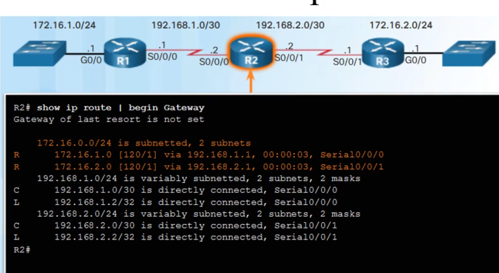
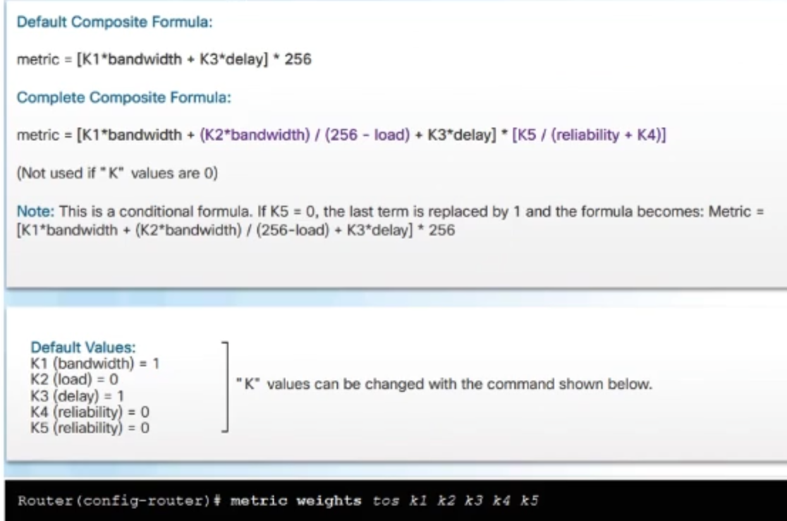
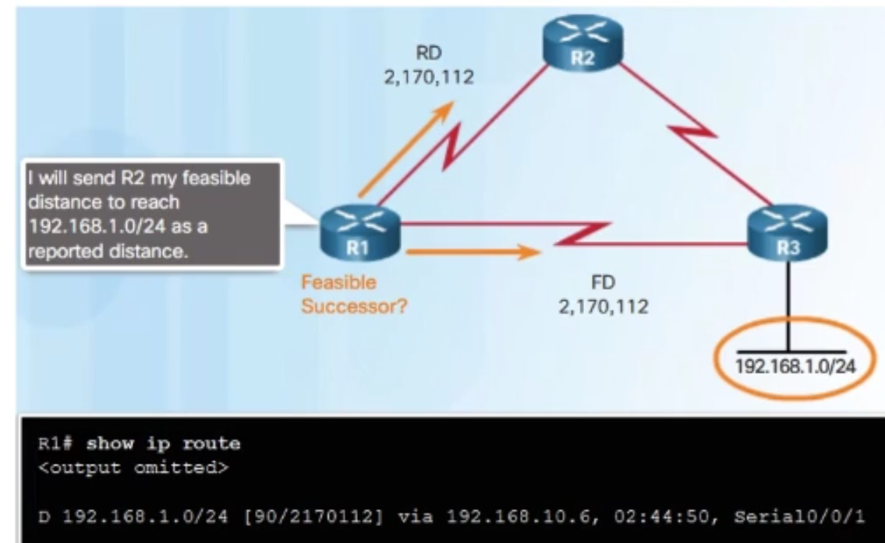
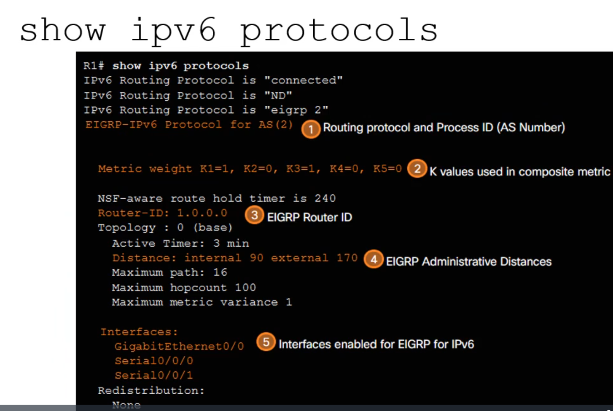

# EIGRP
## Динамическая маршрутизация

* **Протоколы маршрутизации** - это набор процессов, алгоритмов и сообщений для обмена информацией о маршрутах и заполнения таблицы маршрутизации

* Задачи протоколов автоматически:
  * Изучать удаленные сети без участия 
  * Поддерживать актуальную информацию о сети
  * Выбирать наилучший путь
  * Выбирать резервный путь

У протоколов есть своя собственная таблица маршрутизации, которая не зависит от таблицы маршрутизации на маршрутизаторе

Все процессы принятия решений происходят локально на маршрутизаторе

### IGP(Interior Gateway Protocols) и EGP(Exterior Gateway Protocols)

Интернет делится на набор автономных систем, взаимодействующих друг с другом(**Внешняя маршрутизация [BGP](https://habr.com/ru/articles/450814/)**). У каждой АС есть владелец(провайдер или крупная организация). Внутри АС осуществляется **внутренняя маршрутизация** 

### Distance vector vs Link state

#### Distance vector

* Объявляет маршрут с помощью указания расстояния(какая-то метрика, зависит от типа протокола) и вектора(маршрутизатор следующего перехода или указание выходящего интерфейса для сети)

#### Link state

* Протоколы обмениваются состояниями каналов(пропускная способность и номера сетей) и строят топологию сети

### Проблема classful протоколов

Видим что из R2 в сеть 172.16.0.0/16 можно попасть из 2 интерфейсов, т.е как бы разорвали сеть

* Не передают информацию о маске подсети в своих обновлениях маршрутизации

* Не поддерживают маски подсети переменной длины (VLSM) и бесклассовую междоменную маршрутизацию (CIDR)

* Создают проблемы в `разорванных` сетях

Если пингануть хост из этой сети, то результат будет непредсказуемым(пакеты могут дойти, а могут не дойти), что плохо

**При работе с бесклассовыми протоколами необходимо следить за адресацией и не допускать разорванных сетей**

В современном мире бесклассовой сетью никто не пользуется

### Сеть с classless протоколом

**маршрут в разорванной сети определился верно**

* Бессклассовые протоколы маршрутизации IPv4, включающие в обновления маршрутизации данные о маске подсети:
  * RIPv2
  * EIGRP
  * OSPF
  * IS-IS
* Поддержка VLSM и CIDR
* Протоколы маршрутизации IPv6 являются бесклассовыми(т.к в IPv6 нет классов)

### Характеристики протоколов маршрутизации

### Distance Vector Protocol

* Маршрутизатор осуществляет обмен обновлений маршрутизации для получения информации обо всех удаленных маршрутах

* Стремясь обеспечить конвергенцию, маршрутизаторы выполняют несколько раундов передачи периодических обновлений

* Сеть сходится, когда все маршрутизаторы имеют полную инфу о всей сети

* Время конвергенции это время необходимое роутеру для обмена данными, расчёта оптимальных путей и обновления таблиц маршрутизации

* маршрутизаторы на базе вектора расстояния не имеют данных о топологии сети

* Некоторые протоколы вектора расстояния регулярно отправляют обновления:
  * **RIPv1** отправляет обновления как широковещательные рассылки 255.255.255.255
  * **RIPv2 и EIGRP** могут использовать групповые адреса для доступа только к определенным соседним маршрутизаторам(с помощью специального группового адреса протокола)
  *  **EIGRP** также может использовать одноадресную рассылку для связи с определенным соседним роутером
  *  **EIGRP** отправляет обновления только по необходимости, а не переодически
*  

### Distance Vector Protocols

* Алгоритм на базе векторов расстояния определяет следующие процессы:
  * Механизм отправки и получения данных маршрутизации
  * Механизм расчёта оптимальных путей и добавления маршрутов в таблицу маршрутизации
  * Механизм обнаружения и реагирования на изменения в топологии
* Протокол RIP использует алгоритм [Белмана Форда](https://habr.com/ru/companies/otus/articles/484382/) в качестве алгоритма маршрутизации
* Протоколы IGRP и EIGRP используют алгоритм маршрутизации [DUAL](https://studfile.net/preview/5759717/page:36/)(Diffusing Update Algorithm - агоритм диффузного обновления)

### Воспоминание о RIP

## Хар-ки EIGRP

* Interior Gateway Routing Protocol - первый протокол маршрутизации Cisco для ipv4
  * Разработан в 1984
  * Использует пропускную способность, задержки, загрузку и надёжность для вычисления метрики
  * Обновления каждые 90 секунд
  * максимум 255 хопов
  * **Классовый протокол**

* В 1992 появился EIGRP
  * Использует Hello keepalive mechanizm
  * Использует таблицу топологии, в которой хранятся все маршруты, вычисленные соседними маршрутизаторами
  * Мгновенная сходимость
  * Поддержка многих протоколов сетевого уровня
  * Стеконезависимый(может поддерживать другие протоколы своего уровня) 
  * **Бесклассовый протокол**

### EIGRP

* Cisco протокол вектора расстояний

* Выпущен в 1992 году, затем с 2013 описан в стандарте IETF

* named EIGRP позволяет настраивать EIGRP для IPv4 и IPv6 в одном режиме конфигурации

* Использует Diffusing Update Algorithm (DUAL) для поиска маршрута без петель и поиска резервного пути

* Устанавливает соседство между 2 соседними роутерами

* Использует Reliable Transport Protocol(RTP) для передачи пакетов

* Пересылает частичные и ограниченные обновления
  * Обновления передают только изменения(добавления/удаления маршрута или перерасчёт метрики) в сетях
  * Обновления получают только те маршрутизаторы, которые затрагивают обновления

* Поддерживает балансировку нагрузки по путям с равной и не равной стоимостями

### Protocol Dependent Modules(PDMs)

Стеконезависимость осуществляется за счёт модулей PDM. С помощью них строятся:
1. таблицы соседей
2. Таблицы топологий
3. Таблицы маршрутизации

т.е отдельный модуль строит таблицу для отдельного сетевого протокола

* отвечает за выполнение функций каждого протокола сетевого уровня

* Поддерживает таблицы соседей и топологии

* Строит и передаёт специфичные для протоколов пакеты в DUAL

* Является интерфейсом между Dual и таблицей маршрутизации для протокола

* Вычисляет метрику и передаёт в Dual

* Выполняет фильтрацию и ACL

* Перечисляет маршруты, полученные от других протоколов маршрутизации(стековонезависимый)

### RTP (Reliable Transport Protocol)

Т.к EIGRP - стеконезависимый протокол, то для него был придуман транспортный протокол

* Для передачи и получения EIGRP пакетов

* Осуществляет как **надежную** (с подтверждениями), так и **ненадежную**(без подтверждений) доставку

* Посылает пакеты EIGRP по групповому адресу: 224.0.0.10 для ipv4 и FF02::A для IPv6

### Authentication

* Поддерживает аутентификацию

* Не шифрует EIGRP обновления маршрута

### Типы пакетов EIGRP

* **Hello** - для поиска соседей и поддержания смежности между соседями, доставляется ненадежно по мультикасту
  * малый размер сообщения для экономии пропускного канала

* **Update** - Распространяет маршрутную инфу соседям, надежная доставка по юникасту или мультикасту
  * Именно это сообщение посылается при изменении сети

* **Acknowledgment** - подтверждение получения пакета, ненадежно по юникасту
  * Пустой пакет с одним заголовком

* **Query** - запрос маршрутизатора от соседей, надежная доставка по юникасту или мультикасту

* **Reply** - ответ на Query, надёжная доставка по юникасту

### EIGRP Hello Packets

### EIGRP Update и Acknowledgment Packets

* **Update** - посылается только есть сеть изменилась, только тем роутерам, которых это касается
  * Update с подтверждением

* **Acknowledgement(ACK)** - пустой Hello пакет
  * Посылается для Update, Query, Reply 

### EIGRP Query и Reply пакеты

* Query - для поиска новых маршрутов и других задач EIGRP
  * Рассылается соседним роутерам, в случае, если маршрут у целевого роутера стал не доступен, для того, чтобы узнать резервный маршрут
  
* Reply - ответ на Query от всех соседей не зависимо от того, есть ли у них инфа о резервном маршруте или нет

### Инкапсуляция EIGRP сообщений

### Заголовок пакета EIGRP

* Opcode - тип сообщения
  * У acknoledgement нет отдельного кода, т.к это hello без данных
* Autonomous System Number - ID for this EIGRP routing proccess

Пакет с параметрами

K1, K2, K3, K4, K5 - коэфы для вычисления метрики

**Пакет для внутренних маршрутов**

**Пакет для внешних маршрутов**

Внешний маршрут - это маршрут изученный с помощью другого протокола маршрутизации или с помощью EIGRP с другим номером АС

## Алгоритм работы EIGRP

### Поиск соседей

R1 отправляет hello для обнаружения соседей

R2, получив hello, отправляет update, содержащий список сетей, доступных роутеру R2. При этом нельзя отправлять инфу о сетях, полученных от R1. 

R2 отправляет hello, чтобы сообщить о своём присутствии и ждёт update от R1

Каждый update должен быть подтвержден сообщением ack

Все подтвержденные маршруты добавляются в таблицу топологии

После того, как соседние роутеры обменялись всеми возможными маршрутами и заполнилась таблица топологии считается, что сеть сошлась

### Составная Метрика EIGRP

для вычисления метрики EIGRP использует пропускную способность канала, загрузка канала, задержка канала, надежность канала

на то, какой вклад будут вносить эти значения, влияют коэфициенты k1,k2,k3,k4,k5

В реальной жизни рекомендуется использовать коэфы k1 = 1(пропускная способность) и k3 = 1(задержка канала), а остальные устанавливать в значение 0, т.к пропускная способность и задержка канала являются постоянными величинами и не зависят от состояния сети

остальные коэфы не используют, т.к они связаны с непостоянными величинами, из-за чего метрика будет часто перерасчитываться загружая пропускную способность канала

Коэфы можно менять вручную, но делать это не рекомендуется

**Команда для изменения весов коэфов**

Просмотр параметров, которые влияют на расчёт метрики, на интерфейсе

* BW - пропускная способность канала(она постояна и зависит только от канала связи)

* DLY - задержка в микросекундах(она постояна и зависит только от канала связи)

* reliability - надежность канала (доля) вычисляется динамически в процессе передачи на канале связи

* txload - загрузка при передаче данных (доля) вычисляется динамически в процессе передачи на канале связи

* rxload - закгрузка при получении данных (доля) вычисляется динамически в процессе передачи на канале связи

Во время расчёта метрики пакет может идти по разным каналам связи, т.е возможны различные пропускные способности и задержки. 
* В формулу для вычисления метрики конкретного роутера **будет добавляться наименьшее значение пропускной способности на всём пути**, 
* в качестве задержки **будет сумма задержек всех каналов, через которые прошёл пакет**

### Настройка bandwidth

пропускную способность можно менять руками, чтобы влиять на значение метрики

Настройка пропускной способности никак не влияет на пропускную способность канала, т.к это физически заданный параметр

нужно менять с осторожностью, т.к может повлиять на другие протоколы маршрутизации

### Delay

можно задать вручную, чтобы влиять на значение метрики

### Вычисление метрики в EIGRP

используются только k1 и k3

Обрати внимание:
* берут обратное значение к пропускной способности
* что сумму задержек делят на 10

### Пример

**Наблюдение у EIGRP обычно большое значение метрики**

### DUAL

Кроме вычисления метрики, нужно понять через понять через какие направления можно добраться до указанной удаленной пути - это задача DUAL

* Поиск лучшего маршрута без петель и резервного маршрута без петель
* Термины
  * Successor (преемник)
  * Feasible Distance (FD - достижимое растояние)
  * Feasible Successor (FS - достижимый преемник)
  * Reported Distance (RD - сообщенное растояние) or Advertised Distance (AD)
  * Feasible Condition or Feasibility Condition(FC - условие достижимости)
  * Процесс выбора наилучшего пути осуществляется DUAL Finite State Machine (FSM)(конечное число состояний, переход между ними, операции)
  * DUAL FSM отслеживает все маршруты и выбирает наилучший по метрике, добавляет его в таблицу маршрутизации
  * DUAL FSM находит резервный маршрут

### Successor and Feasible Distance
Поиск оптимального маршрута

Successor - это маршрутизатор следующего перехода, через который можно быстрее всего добраться до сети назначения(самая маленькая метрика)

Feasible Distance - метрика маршрута

### Feasible Successor Feasible Condition Reported Distance

Поиск оптимального маршрута без петель

из R2 в R3 можно добраться 2мя путями:
1. напрямую
2. через R1

Чтобы маршрут стал резервным путём он должен удовлетворять условию достижимости(Feasible Condition):

`Если Reported Distance меньше чем Feasible Distance у текущего роутера, то маршрут является резервным`

Reported Distance - это расстояние, которое вычислил соседний роутер до указанной сети назначения.

У R2 есть 2 путя, чтобы добраться в сеть 192.168.1.0/24:
1. через R3 
2. через R1, понятно, что feasible distance У R2 в таком случае будет больше, чем feasible distance R1

R1 может добраться до R3 напрямую, о чем говорит в своём Reported distance, которое посылается в R2

R2 видит, что Reported Distance меньше чем его Feasible Distance, поэтому **маршрут R2 -> R1 -> R3 становится резервным**

Это делается, чтобы избежать петель, т.к если Reported Distance >= Feasible Distance, то нельзня гарантировать что оно не является частью пути

в случае поломки основного маршрута, достижимый преемник становится Succesor и перерасчитывается маршрут

**Добавление резервного маршрута возможно только, если выполнилось условие достижимости**

### Просмотр таблицы топологии
можно посмотреть все сети, которые были сообщены соседями

первый столбик:
* P - passive Алгоритм Dual отработал и маршрут добавлен в таблицу маршрутизации
* A - active Сеть находится в активном состоянии перерасчёта, маршруты только вычисляются

Второй столбик - сети назначения

Третий столбик - кол-во преемников для соответсвующей сети

Четвертый столбик - Feasible distance метрика до данной сети

Основной маршрут

Резервный маршрут

Просмотр всех изученных сетей
* видим что тут feasible distance в первой строке больше чем reported distance во второй, поэтому вторая строка резервным маршрутом не будет

### Коненчный автомат DUAL

### Просмотр работы FSM

Есть резервный маршрут

Нет резервного маршрута

## Настройка и отладка EIGRP
Здесь R1, R2, R3 -находятся в одном домене маршрутизации

### Команды настройки

Включить процесс EIGRP

* здесь номер автономной системы это номер процесса работы eigrp
* может быть несколько АС на одном роутере
* АС - это 2 байтовое число
* **Номер АС должен совпадать на всех роутерах в домене маршрутизации**

Настройка router ID

* id роутера это 32 битное число
* если не указали id роутера, то он это сделает самостоятельно
  * Если указан router id то выбирается это значение
  * Если router id не указан, то выбирается большое значение ipv4 адреса назначенного на loop back интерфейсе
  * Если loop back интерфейсов нет, то выбирается наибольший ipv4 адрес, назначенный на физическом интерфейсе роутера. **Интерфейс должен быть в рабочем состоянии**
  * Если предыдущие условия были не выполнены и **router id так и не назначился, то роутер работать не будет** 

Включить EIGRP маршрутизацию на интерфейсе

* добавление интерфейса в процесс маршрутизации + указание сетей, о которых будет распространяться инфа этим роутером 
* Вместо сети можем указать только класс, тогда все интерфейсы подходящие под этот класс будут включены в процесс маршрутизации
* **Достаточно только указать адрес, маска не требуется**
* Если требуется исключить некоторые интерфейсы из домена маршрутизации, то требуется добавить wildcard маску
* **wildcard маска это просто инвертированная обычная маска подсети**
* **Можно указывать прямую маску, но при просмотре в раннинг конфиге всё равно будет обратная маска**

Настройка passive interface

* указываем, если мы не хотим, чтобы какой-то интерфейс передавал трафик маршрутизации, при этом мог бы участвовать в маршрутизации, как адрес сети, который мы распространяем
* **В интерфейсы не будут распространяться eigrp пакеты, при этом инфа о сети на этих интерфейсах будет передавать в eigrp пакетах**

Настройка passive interface глобально

* **можно настроить глобально настроить на все интерфейсы как passive, а потом для нужных интерфейсов убрать эту настройку, чтобы через них можно было передавать трафик маршрутизации**

### Примеры

### show ip protocols

Показать настройки всех протоколов маршрутизации

**У всех роутеров в одном домене маршрутизации должны быть одинаково настроены коэфы k1 k2 k3 k4 k5**, иначе сеть не сойдётся

### show ip eigrp neighbors

показать список соседних смежных роутеров

### show ip route

показать таблицу маршрутизации

## EIGRP для IPv6

Для ipv6 есть протоколо зависимые модули, которые позволили Eigrp безболезнено перейти на ipv6, т.е все схемы и алгоритмы работы такие же отличаются только адресация и транспортный протокол

**будут использовать link local адреса, т.к все процессы происходят по ним**

### Eigrp для ipv6 vs Eigrp для ipv4

### настройка  для ipv6

включить ipv6 маршрутизацию

включить eigrp процесс

* **номер АС одинаков на роутерах в одном домене маршрутизации**

настроить router id

* является 32 битным числом
* **Это поле стало обязательным, т.к на роутере может не оказаться ни одного ipv4 адреса**

активировать процесс eigrp для ipv6

включить маршрутизацию на интерфейсе

* это новое дествие для ipv6 сетей
* **Делаем на каждом интерфейсе по отдельности**

настроить passive интерфейсы

### отладка ipv6

#### show ipv6 eigrp neighbours
показать соседние смежные роутеры

#### show ipv6 protocols

покажет полную настройку протоколов маршрутизации для ipv6

#### show ipv6 route

просмотр ipv6 маршрутов

