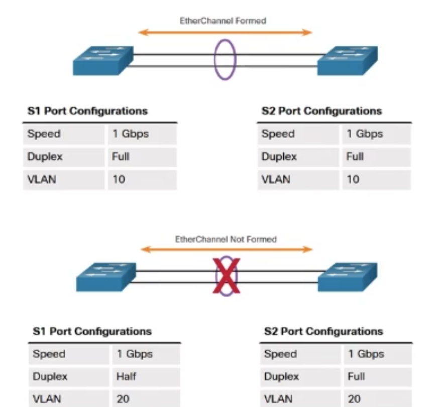

# EtherChannel

Резервирование может быть использовано для улучшение пропускной способности, но stp такой опции не предлагает

* необходимо отправлять весь трафик с уровня access на уровень distribution

* Необходимо быстрое соедение между access и distribution

* Соединение коммутатора с быстрым каналом связи

* Но STP блокирует избыточные каналы связи

Поэтому придумали **EtherChannel**

* это протокол Cisco

* В EtherChannel можно объединить каналы связи, работающие на одной скорости, поэтому можно объединять только 2 канала FastEthernet или 2 канала GigabitEthernet, **нельзя перемешать FastEthernet и GigabitEthernet**

* Объединяет несколько каналов FastEthernet или GigabitEthernet в один логический канал связи

* Создаётся виртуальный интерфейс PortChannel
  * Настройки на PortChannel распространяются на все каналы внутри него

* Балансировка нагрузки между портами
  * балансировка происходит по 4 критериям:
    * IP источника
    * MAC адрес источника
    * IP назначения
    * MAC адрес назначения

* Каналы(объединенные порты) в EtherChannel не блокируются STP, т.к по сути это один канал логический связи 

* Продолжают работать, даже если один канал связи отпадёт, пока остаётся один рабочик канал связи

* Протоколы [PAgP и LACP](https://habr.com/ru/articles/334778/)

## Ограничения EtherChannel

* Можно использовать порты одного типа(FastEthernet или GigabitEthernet) и дуплексности

* Максимум 8 портов в одном EtherChannel

* На один коммутатор максимум 6 EtherChannel
  * Это физическое ограничение связанное с кол-вом портов

* Соединяет только 2 устройства

* Может быть между 2 коммутаторами или коммутатором и хостом с поддержкой технологии

* Требует совместимой(одинаковой) настройки обоих устройств

## PAgP - Port Aggregation Protocol

* Протокол Cisco

* Придуман для автоматического согласования EtherChannel с помощью согласований

* Пакеты PAgP отправляются раз в полминуты для поддержания канала

* Требуется одинаковые скорость, дуплекс, набор VLAN
  * Если это access порты, то все такие порты должны быть добавлены в 1 VLAN
  * Если это trunk порты, то все такие порты должны быть настроены одинаково

* Проверяет однородность настроек, добавление и отключение портов

* **есть 3 режима**:
  * On - статическая настройка
  * Desirable - динамическое согласование
    * Активно посылает сообщения о согласовании, с запросом на установку EtherChannel
    * также принимает запрос на установку EtherChannel
  * Auto - динамическое согласование
    * Ничего не посылает, просто принимает запрос на установку EtherChannel
  * **См таблицу согласования режимов**

## LACP - Link Aggregation Control Protocol

* Работает аналогичным образом с PAgP

* IEEE 802.3ad (IEEE 802.1AX)
  * Открытый стандарт

* Для автоматического создания логического канала связи с помощью согласований

* Проверяет однородность настроек, добавление и отключение портов

* Поддерживает 8 резервных каналов

* **Есть 3 режима**:
  * On
  * Active(Аналог в PAgP - Desirable)
  * Passive(Аналог в PAgP - Auto)
  * **См таблицу согласования режимов**

## Настройка PAgP

**Выключен по умолчанию**

### Создание PortChannel

### Настройка PortChannel. 

* Настраивается как обычный интерфейс
* Настройка примененная на PortChannel применится на все физические интерфейсы, объединенные в PortChannel

## Настройка LACP 

**Выключен по умолчанию**

### Создание PortChannel

### Настройка PortChannel

* Настраивается как обычный интерфейс
* Настройка примененная на PortChannel применится на все физические интерфейсы, объединенные в PortChannel

**Отличие настройки только в режимах**

### Пример Настройки LACP

## Команды проверки

### Посмотреть общие настройки

### Если несколько EtherChannel, то общая информацию смотрим так:

### Подробная информация:

## Информация для интерфейса:

## Отладка EtherChannel

**Проверь что**:
* Одинаковый тип интерфейсов, а также их дуплексность

* Порты EtherChannel в одной VLAN

* Согласованна настройка Trunk(Native и Allow VLAN)

* Одинаковая настройка портов в EtherChannel
  * Поэтому порты настраиваем через EtherChannel 

* Совместимость режимов портов для PAgP или  LACP

## Внесение изменений в EtherChannel

**Чтобы перенастроить EtherChannel, нужно удалить старый EtherChannel, создать новый с изменненными настройками**