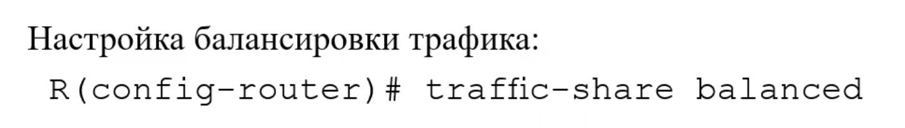

# Автоматическое объединение в EIGRP


## Automatic Summarization
позволяет роутерам группировать сети и объявлять их как одну большую по классу сети, т.е использовать один объединенный маршрут

это может быть удобно, если у нас очень много маршрутов, и позволяет облегчить поиск путём уменьшения кол-ва маршрутов


## Проверка настройки Automatic Summarization


Начиная с 15ой версии Cisco IOS авто саммаризация отключена (`show ip protocols`)

Таблица маршрутизации R3 роутера с картинки из начала лекции(саммаризация отключена)


## Включение(Выключение) саммаризации


### Пример


## Особенности Объявление маршрутов


При настройке саммаризации работает правило

`Не отправлять объявление маршрута до сети в интерфейсы, входящие в сеть`

Примеры:
1. (левая картинка) По правилу маршрут отправится на интерфейсы S0/0/0 и G0/0/1, но не отправится на S0/0/1, т.к 192.168.10.4/30 входит в сеть 192.168.10.0/24

2. (Правая картинка)По правилу маршрут отправится на интерфейс S0/0/1, т.к адрес 172.16.0.0/30 и 172.16.1.0/24 входят в сеть 172.16.0.10/16, а 192.168.10.4/30 нет

Это сделано нарочно для избежания петель
### Проверка маршрутизации

Видим именно объединенный маршрут


### Проверка таблицы топологии

Видим, что есть 2 записи маршрутизации для этой подсети


Если сеть разорвана, то маршурт может быть не оптимальным, т.к для 2 разных маршрутизаторов ищется маршрут в одну сеть см рисунок

## Интерфейс Null 0


Роутеры распространяют адрес классовой сети, но не все подсети оттуда могут быть настроены и доступны. Если какой-то пакет придёт в недоступную сеть, то есть риск, что этот пакет будет блуждать по сети, пока не кончится TTL

Чтобы избежать такой ситуации используется NULL0 интерфейс. Он используется для отправки в интерфейс этой объединенной сети пакетов для недоступных подсетей

Все пакеты попадающие на этот интерфейс отбрасываются, при этом соседним роутерам приходит уведомление о том, что пакет был отброшен

Это виртуальный интерфейс

EIGRP для IPv4 автоматически включает в себя объединенный маршрут Null0 при следующих условиях
* Включено автоматическое объединение(cаммаризации)
* По крайней мере одна подсеть была получена через EIGRP
* Существует 2 или более команды сетевого маршрутизатора EIGRP

Можно посмотреть с помощью show ip route

При отключении саммаризации, интерфейс null0 удаляется из таблицы маршрутизации

### Возникновение петли, в случае отсутствия интерфейса Null0


R2 отправляет R1 пакет на адрес 172.16.4.10

Далее R1 выясняет, что сеть 172.16.0.0/16 находится в направлении R2, поэтому посылает ответ туда

У R2 нет записи для 172.16.4.0, но есть маршрут по умолчанию т.е в сторону R1

и тд таким образом образуется петля маршрутизации


если есть интерфейс NULL 0


R2 отправляет R1 пакет на адрес 172.16.4.10

Далее R1 выясняет, что сеть 172.16.0.0/16 находится в направлении R2, поэтому посылает ответ туда

У R2 нет записи для 172.16.4.0, но есть маршрут(172.16.0.0/16 маршрут более точный, поэтому роутер отправит пакет туда) в интерфейс NULL0, поэтому пакет отбросится

# Другие настройки EIGRP

## Распространение статического маршрута по умолчанию

рассматривать будем следующую топологию 


статический маршрут по умолчанию до провайдера настроен только на R2, но остальным роутерам тоже нужно знать, где он находится

Это можно сделать автоматически с помощью EIGRP


`redistribute static` - **только для распространения статических маршрутов**

Пример


Как выглядит распространенный маршрут на R1 и R3


обрати внимание на D*EX
* D - маршрут изучен EIGRP
* * - кандидат на маршрут по умолчанию
* EX - external route, маршрут вне домена EIGRP, это внешне изученный маршрут 

170 - административное расстояние для внешних маршрутов(было 90)

## Аналогично для IPv6


## Настройка ограничения на bandwith при отправке служебных сообщений

* настройка проводится на интерфейсе
* по умолчанию это 50 % пропускной способности канала
* ограничение работает на bandwith канала, т.е если поменять bandwith вручную(увеличить до $10^{999}$), то и ограничение станет большим и может начать забивать канал


### для IPv4

* percent это ограничение в процентах, обозначающее процент пропускной способности, который может использовать eigrp для отправки служебных пакетов


### для Ipv6


## Настройка Hello и Hold Timers
* Настройка производится только на интерфейсе, соответственно влияет на hello и hold timers **только этого интерфейса**

* hello timers - как часто отправляются hello пакеты (раз в N секунд)

* hold timers - как долго роутер будет ждать hello пакета от соседа, пока не станет считать его недоступным(N секунд)

* На соседних роутерах hello и hold таймеры могут не совпадать. Они могут быть различны на разных роутерах и интерфейсах

### Для IPv4


### Для Ipv6


### Пример


* рекомендуется ```hold timers = 3 * hello timers```

## Балансировка нагрузки

* По умолчанию Eigrp может балансировать нагрузку между каналами с одинаковой метрикой до одной сети
* По умолчанию доступно 4  маршрута с одинаковой стоимостью к одной и той же сети назначения 


### Настройка максимального кол-ва путей


## Unequal-Cost Load Balancing

* позволяет осуществлять балансировку между каналами с разной метрикой
* Чтобы маршрут с неравной метрикой мог быть добавлен в таблицу маршрутизации, он должен соответствовать 2 критериям
  * Маршрут должен быть без петель и являться возможным преемником или иметь объявленное расстояние, которое меньше суммарного расстояния
  
  * Метрика маршрута должна быть меньше метрики оптимального маршрута (перемника), помноженной на откланение, настроенное на маршрутизаторе 


### Настройка коэффициента балансировки


* коээфициент это степень откланения наилучшего маршрута
  * например, если этот коэф равен 2, то подходят маршруты с метрикой в 2 раза большей, чем метрика лучшего маршрута и всё что лучше

### Настрока балансировки трафика
* Включение самой балансировки


## Поиск и устранение неисправностей

Посмотерть находятся ли роутеры в соседстве
* используй пинг роутеров и сетей


### посмотерть таблицу соседей
* Убедись что одинаковы номер АС
* Убедись, что коэфы k1 k2 k3 k4 k5 одинаково настроены на соседях
* таймеры hold и hello настроены не противоречиво


### посмотреть таблицу маршрутизации


### посмотреть настройку протокола
Показ всех настройки протокола маршрутизации


сети распространяемые протоколом


## проверка интерфейсов, включенных в домен eigrp


## Проверка состояния интерфейсов


## Проверка Passive interface
через пассивные интерфейсы не проходит служебная инфа маршрутизации, следовательно маршруты не распространяются

пассивные интерфейсы не должны настраиваться между роутерами внутри домена маршрутизации


## Добавление сетей в домен маршрутизации


## Автосаммаризация
Или:

1. **Аккуратнее с разорванной сетью при саммаризации**
2. **Отключай саммаризацию**. 
   1. по умолчанию она отключена


