# [FHRP First hop redundancy protocol](https://habr.com/ru/companies/otus/articles/919128/)
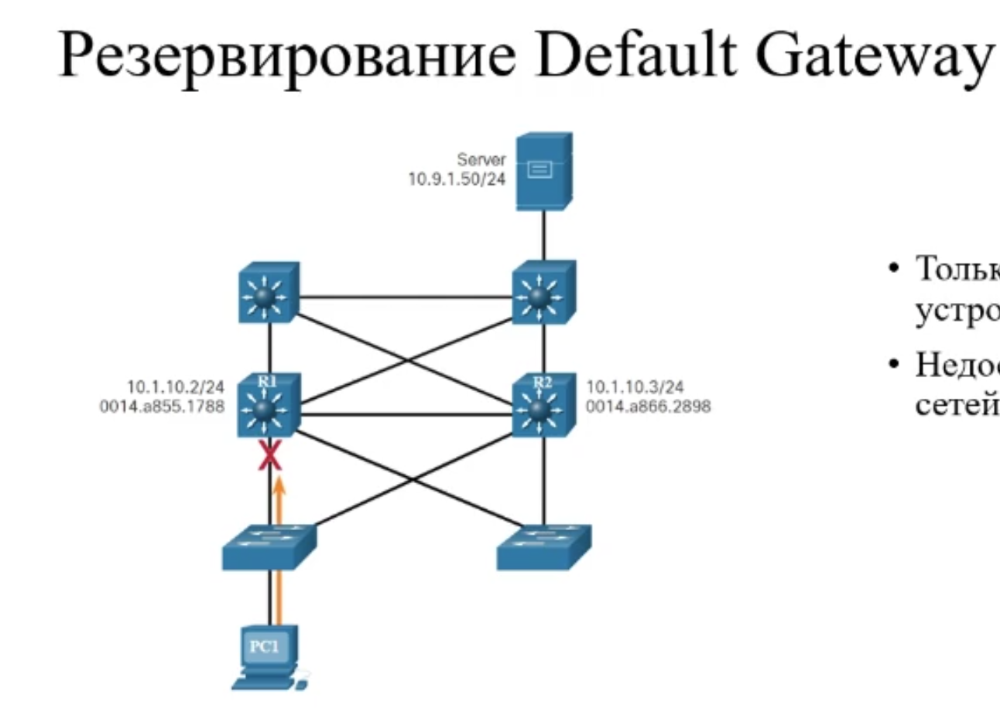

**Решает проблему резервирования шлюза по умолчанию**

* Только один шлюз на устройстве

* Недоступность других сетей при поломке шлюза по умолчанию

## Виртуальный маршрутизатор

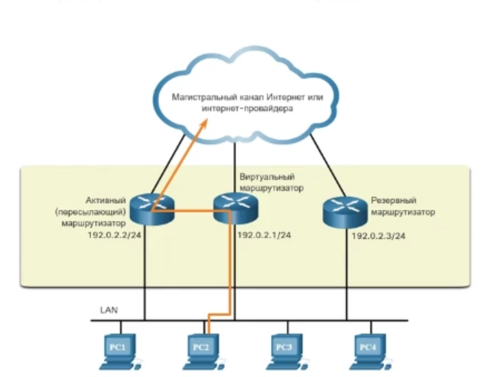

**Создание виртуального маршрутизатора и объединение группы маршрутизаторов, которые будут работать как один виртуальный маршрутизатор**

* Виртуальный маршрутизатор имеет свои виртульные IP и MAC адреса

* Клиент делает шлюзом по умолчанию виртуальный IP адрес

* Выполняет роль шлюза по умолчанию для конечных устройств

* Redundancy protocol определяет активный физический маршрутизатор и включает резервный

В случае сбоя активного маршрутизатора происходит следующее

1. Резервный роутер перестаёт видеть сообщения приветствия от пересылающего роутера

2. Резервный роутер принимает роль передающего роутера

3. Хосты не замечают перебоев в сети, т.к новый пересылающий роутер использует как адрес IPv4 так и MAC адрес виртуального роутера

## First Hop Redundancy Protocols

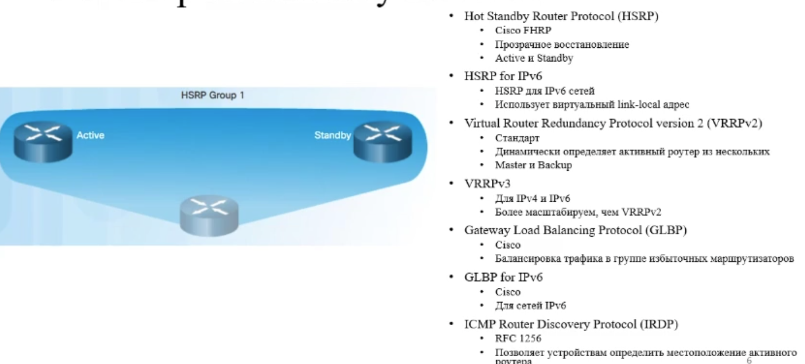

**изучаем только HSRP**

## Обзор HSRP

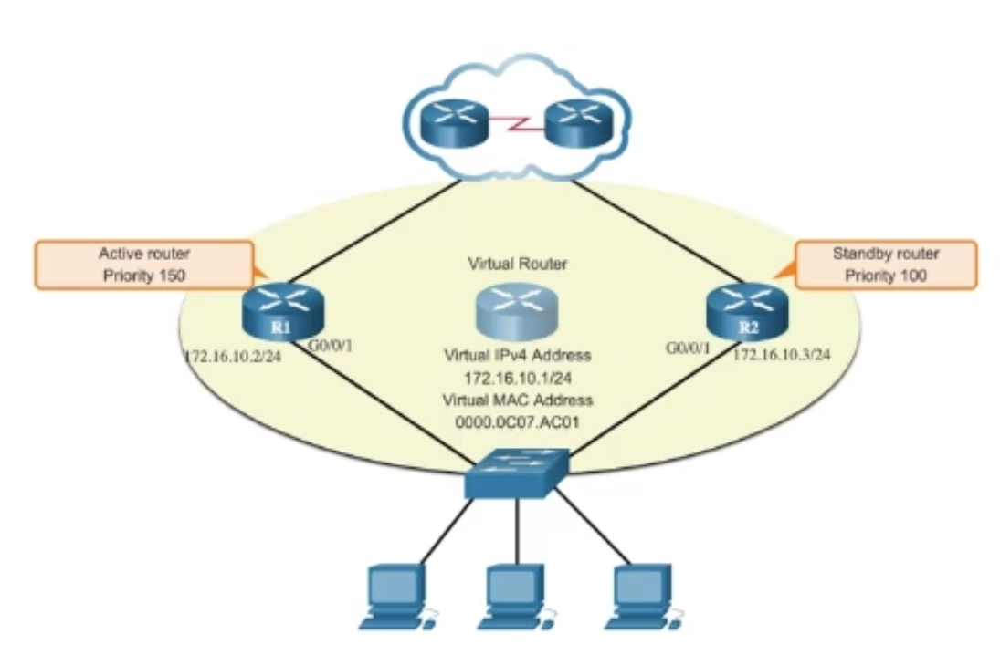

* Протокол Cisco

* Есть 2 версии(не совместимы)

* У роутеров(активного и пассивного) есть свой ip и MAC в сети

* По умолчанию **активным выбирается роутер с большим IP**, но это можно настроить вручную с помощью приоритетов

* Используется HSRP приоритет. **У кого он больше тот и active**. 
  * По умолчанию приоритет 100
  * приоритет в диапозоне от 0 до 255
  * Команда `standby priority`
  
* При поломке активного маршрутизатора его роль не меняется, даже если добавился роутер с большим приоритетом. Когда сломанный маршрутизатор вернут в рабочее состояние, он вновь станет активным. Это же относится к загрузке (активным маршрутизатором станет тот, который первый включился и участвовал в выборах)
  * По умолчанию **выборы активного маршрутизатора происходят только один раз**
  * Можно использовать команду `standby preempt`, для принудительного перезапуска выборов(только в случае, когда прошлый активный роутер был выбран за счёт приоритета), что позволяет нам сменить текущий активный роутер на желаемый

* Используются Hello пакеты для выборов и поддержания связности(каждые 3 секунды) на multicast группы

* Hold интервал - 10 секунд
  * Если в течении 10 секунд резервный роутер не получил hello от активного, то считается, что активный роутер вышел из строя и теперь его заменяет резервный

* Настраивается на интерфейсе подключенном к локальной сети, именно этот интерфейс является шлюзом для этой локальной сети

* такие настройки должны быть проведены для всех локальных сетей, связанных сетью виртуального маршрутизатора

**Активный роутер пересылает клиентский трафик, а резервный следит за Hello сообщениями**

## Разницы между версиями HSRP

**Первая версия HSRP включена по умолчанию**

* виртуальный MAC адрес генерируется на основании номера группы, поэтому настроенные роутеры должны находиться в одной группе

* виртуальный IP адрес задаём вручную 

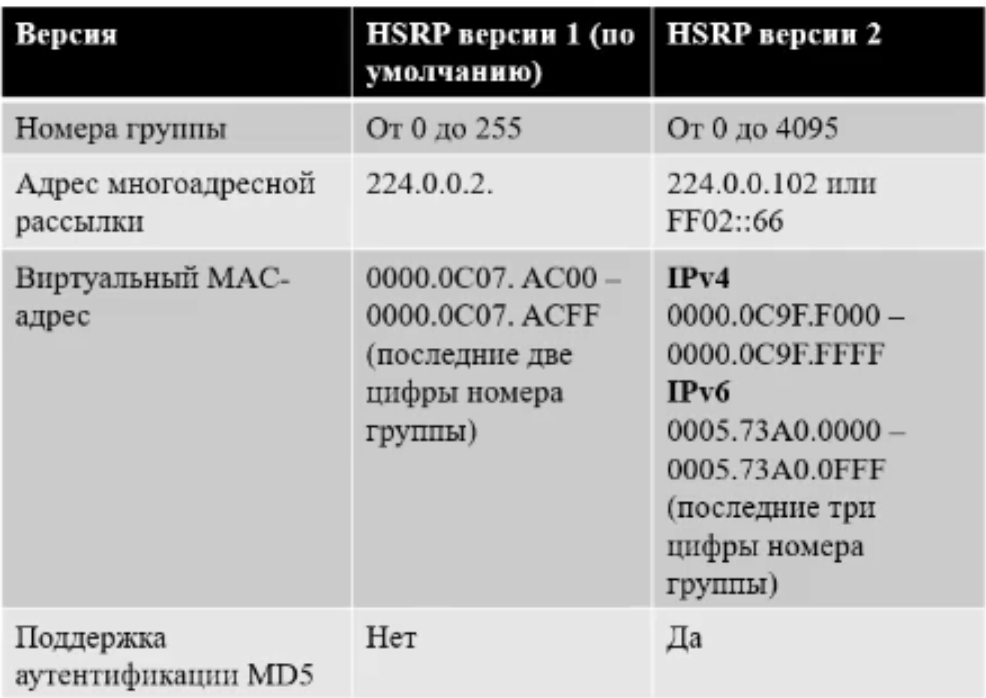

## Состояния HSRP

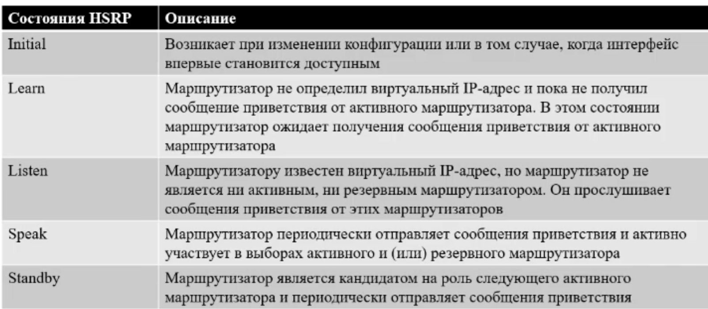

## Настройка HSRP 

### Включение 2 версии

### Настройка виртуального IP адреса

### Настройка приоритета
* Настраивается только на маршрутизаторе, который мы хотим сделать активным

### Настройка preempt
* Настраивается только на маршрутизаторе, который мы хотим сделать активным
* Требуется предварительная настройка приоритета

### Настройка имени группы
* Опциональна
* Должна быть одинаковой для всех роутеров в одной группе

### Пример настройки 
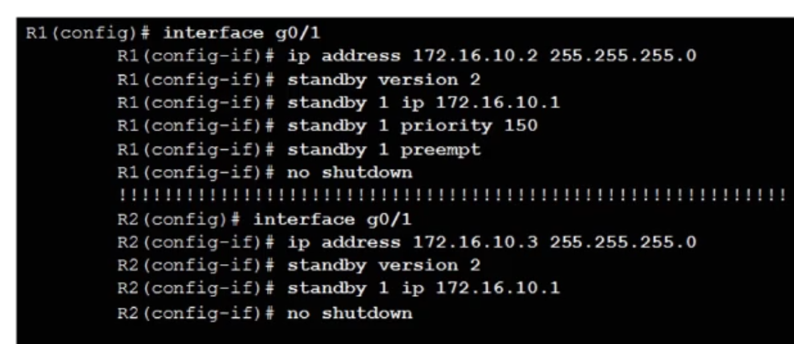

У роутеров свои IP адреса на интерфейсах, но общий виртуальный IP адрес. **Эти адреса должны быть в одной сети**

**виртуальный IP адрес будет указываться в качестве шлюза по умолчанию на хостах**

## Отладка HSRP

### show standby - показать всю конфигурацию HSRP
* вывод на активном роутере
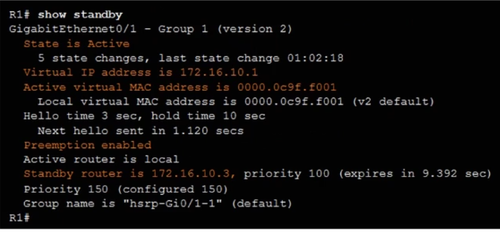

* вывод на резервном роутере
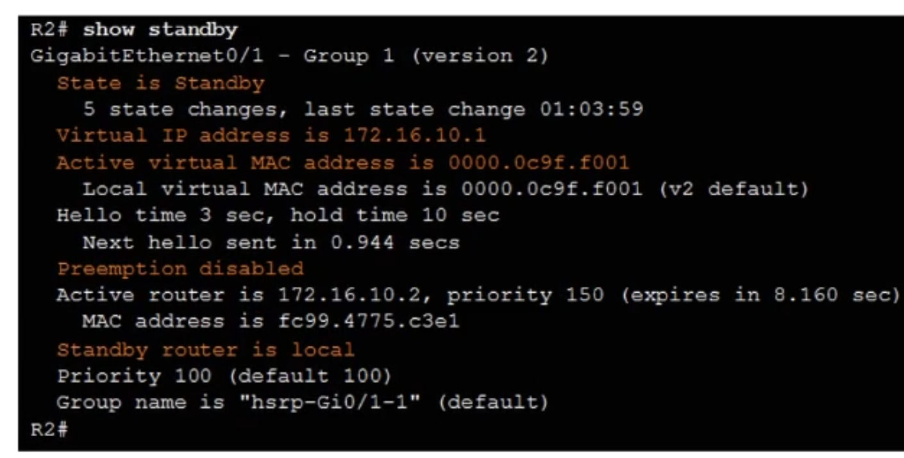

### show standby brief - показать короткую инфу о HSRP
* вывод на активном роутере
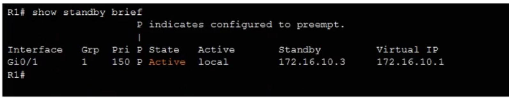

* вывод на резервном роутере
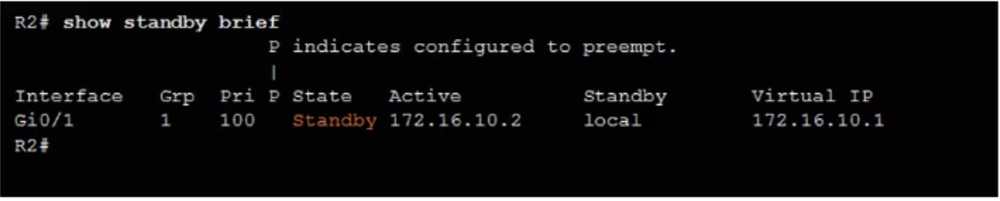

## Поиск и устранение неполадок в HSRP

Неполадки:
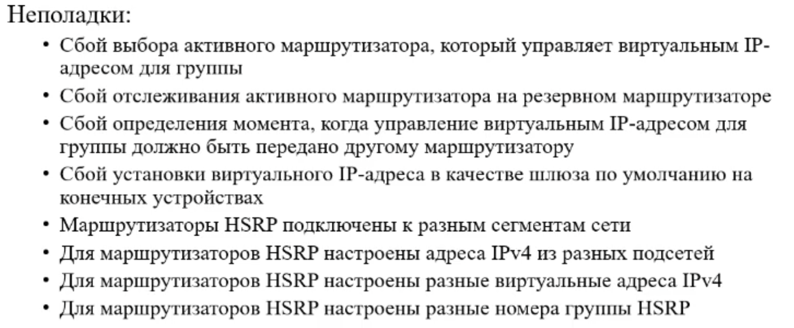

## Команды debug
* Дебаг пакетов
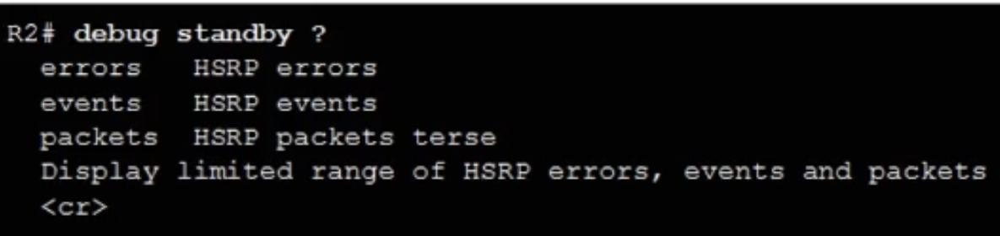

### debug standby packets - какие hello пакеты куда пересылаются
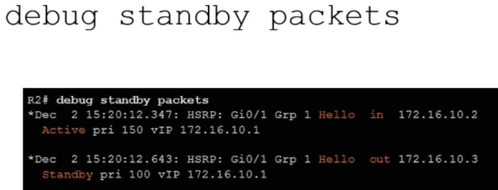

### debug standby terse  - показать смену состояний роутеров
* пример когда активный перестал работать(его заменил резервный)
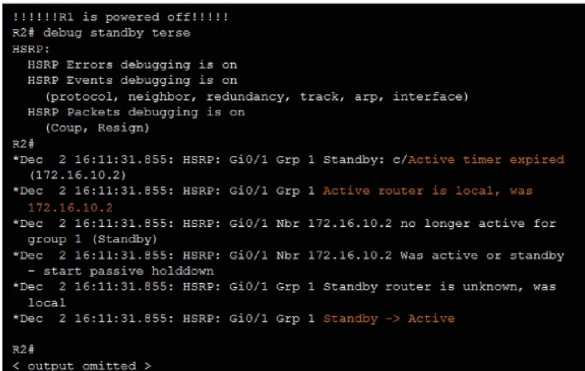

* пример, когда активный вновь вернулся в рабочее состояние
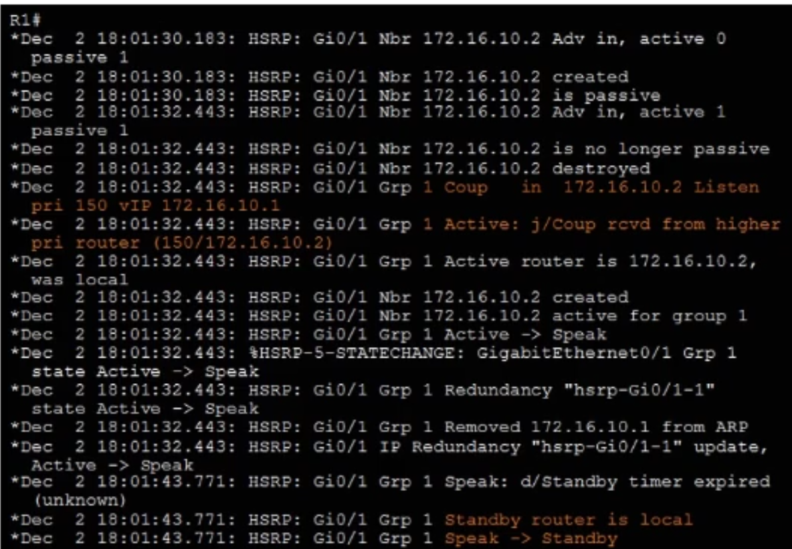