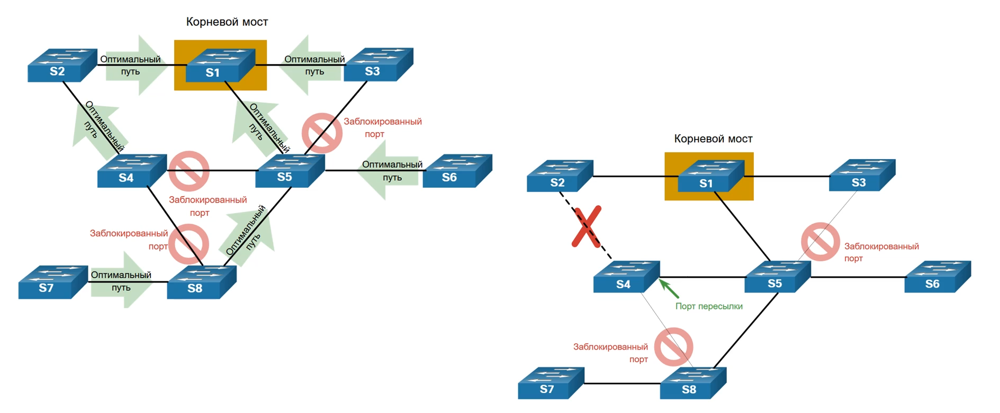
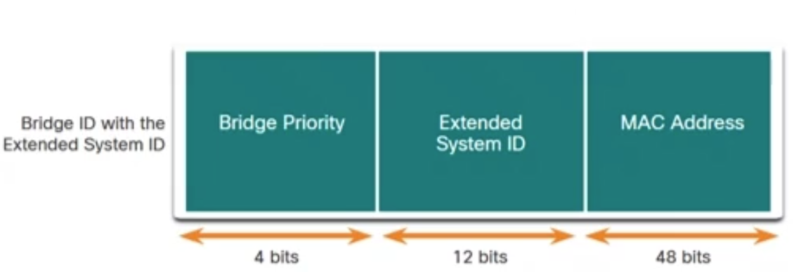

# Обзор протокола STP

## Проблемы избыточности 
**Проблемы колец 2ого уровня:**

* **Нестабильность бд MAC адресов** - копии одного кадра, принимаются на разных портах

* **Широковещательные штормы**

* **Множественная передача кадров** - несколько копий одноадресных кадров направляются в один пункт назначения

## Неустойчивость таблицы MAC адресов
[Неустойчивость таблицы MAC адресов](http://blog.netskills.ru/2012/11/2.html)

предположим, что pc 1 решил отправить сообщение pc4

такой кадр сначала приходит на коммутатор s2, который вносит информацию в свою MAC таблицу, что pc 1 подключен к F0/11

Т.К комутатор новый, то он не знает MAC адреса PC4, поэтому он сделает Broadcast рассылку пакета на подключенные интерфейсы

такой пакет получат свитчи S1 и S3, которые тоже занесут mac адрес PC1 в свою MAC таблицу. S1(PC1 подключен к F0/1) S3(PC1 подключен к F0/2)

т.к таблица коммутации пустая, то S1 и S3 сделают broadcast рассылку

таким образом пакет будет отправлен между S1(PC1 подключен к F0/2) и S3(PC1 подключён к F0/1) пакет дойдёт до компа S4

таким образом коммутаторы s3 и s1 перезапишут информацию в таблице коммутации

и тд

Данная ситуация вызовет неустойчивость таблицы MAC адресов

если кол-во устройств увеличится, то работа коммутаторов полностью будет парализована из-за неустойчивости таблицы MAC адресов

## Широковещательный шторм

[широковещательный шторм](https://procloud.ru/blog/technologies/broadcast-storm/)

Это такое кол-во широковещательных кадров, которое заполняет всю доступную пропускную способность и делает сеть недоступной для любого сетевого трафика

* Это приводит к отказу в обслуживании (DoS)
* Может возникнуть за несколько секунд и вывести сеть из строя

## Дублирование кадров

Может возникнуть в результате отправки неизвестного кадра

Неизвестный кадр формируется, когда в таблице MAC адресов коммутатора нет MAC адреса назначения и ему приходится выполнить широковещательную рассылку этого кадра изо всех своих портов, за исключением того порта, на который он был получен

## STP

Протокол связующего дерева, гарантирующий существование только одного логического пути между 2 точками  в сети с помощью намеренной блокировки избыточных путей

[STP](https://ru.wikipedia.org/wiki/STP)

на первом этапе выбирается корневой мост, к которому будет строиться дерево путей до остальных коммутаторов

На следующем этапе каждый коммутатор выбирает оптимальный(с наименьшей стоимостью) путь от себя до корневого моста

Невыбранные пути блокируются, тем самым разрывая петли

порт считается заблокированным, если на нём запрещены отправка и приём сообщений

в случае поломки активных путей или добавления нового коммутатора в сеть, stp перестраивает дерево

# Алгоритм работы STP

все процессы в STP происходят благодаря обмену между коммутаторами сообщений [BPDU](https://ru.wikipedia.org/wiki/BPDU)

здесь стоит обратить внимание на поля с номерами от 5 до 8

* Root_id - ID корневого моста
* Root_path_cost -Стоимость пути до корневого моста
* Bridge ID - ID локального коммутатора, который рассылает пакеы BPDU
* Port ID - ID порта, из которого было получено сообщение BPDU

## Формат BPDU

* Hello timer - интервал BPDU, 2 с(по умолчанию)
  * от 1 до 10 секунд

* Forward Delay Timer - время в состояниях прослушивания и обучения, 15 с (по умолчанию)
  * от 4 до 30 секунд

* Max Age Timer - максимальное время ожидания коммутатора перед попыткой изменения топологии STP, 20 с(по умолчанию)
  * от 6 до 40 секунд

* Massage Age timer - время отправки сообщения корневым коммутатором на все остальные коммутаторы

Значения всех таймеров задаются на корневом коммутаторе, который рассылает инфу о таймерах остальным коммутаторам

## Bridge ID

* Extended System ID - необязательное поле, встречается не везде - это номер VLAN для которого строится дерево
  * Он необязательный, т.к в более ранних версиях STP строилось одно дерево и на VLAN не обращали внимания
  * В более поздних версиях STP появилась возможность строить дерево для каждой VLAN отдельно

* Изначально в BID было 2 поля:
  * Приоритет
    * значение приоритета по умолчанию 32768, его можно менять
  * MAC адрес моста

Если приоритет моста не изменяется, то определяющим для выбора корневого моста становится самый низкий MAC адрес

## Cам Алгоритм STP

**Мост с наименьшим BID становится корневым мостом**
* Рутом станет свитч с наименьшим приоритетом
* **приоритет можно менять вручную с шагом 4096**
* Если приоритет не менялся, то BID будет сравниваться по значению MAC адресов(наименьшее 16 ричное число будет выбрано в качестве рута)

**Для явного указания рутового коммутатора лучше всё-таки менять приоритет**

### Как коммутаторы договариваются, кто станет рутом
на первом этапе каждый коммутатор объявляет себя рутом, т.е ставит свой BID в RootID

Затем BPDU начинают рассылаться на специальный адрес всем коммутаторам в сети.

Получив сообщение от соседа, коммуаторы сравнивают RootID из сообщения со своим BID. 
* Если BID меньше, чем RootID, то коммутатор устанавливает в качестве RootID свой BID и пересылает пакет дальше

* Eсли RootID меньше, то коммутатор оставляет RootID прежним и пересылает кадр дальше 

Пакеты распрастраняются по сети, пока все коммутаторы не получат инфу о Root id

### Как коммутаторы оценивают стоимость до рута

Стоимость корневого пути используется для определения роли порта и того, будет ли блокироваться трафик

пути с наименьшей стоимостью становятся активными путями

стоимость пути определяется стоимостью интерфейса, которая задана по умолчанию и зависит от скорости канала связи

Путь до корневого коммутатора это сумма стоимостей всех интерфейсов, через которые нужно пройти пакету, чтобы добраться до корневого коммутатора

**После выбора Root моста, все процессы в протоколе STP регулируются именно этим коммутатором**

На схеме видно, что рутовый свитч отправляет BPDU пакеты с Path Cost, проходя через коммутаторы, Path Cost увеличивается на стоимость порта, через который пришёл пакет

Таким образом, все коммутаторы узнают кротчайшее расстояние до рута

### Роли портов 

Есть всего 3 роли портов:
1. **Designated port**
   1. **Все порты у рутового коммутатора назначаются Designated** 
   2. Это порт с кротчайшей стоимостью до рута, если он не является рутовым портом
   3. У рутового коммутатора все порты должны быть активными
   4. Designated порт может быть назначен, если у коммутатора ранее уже был назначен root port
   5. 
   6. Этот порт имеет значение на сегментах сети между нерутовыми коммутаторами
   7. На S3 должен оставатся активный порт, через который S4 может закинуть кадры до S1
   8. **В этом случае Designated порт - это просто активный порт, который может передавать трафик от других коммутаторов**
2. **Root port**
   1. Это порт нерутового коммутатора, из которого выходит кротчайший путь до рутового коммутатора
   2. такой порт должен быть на каждом коммутаторе и обязательно в активном состоянии
3. **Alternative port**
   1. 
   2. в сегменте между S2 и S3 нужно заблокировать один из активных портов, а другой порт оставить активным(Designated)
   3. у коммутаторов есть приоритет порта и он определяет какой порт будет заблокирован
   4. если у коммутаторов одинаковый приоритет портов, то активным становится порт с наименьшим BID

### Более сложный пример выбора Designated и Alternate портов

в данном случае, приоритеты портов установлены по умолчанию. Активный порт остался у коммутатора S3 т.к у него самый меньший BID по сравнению с S2

каждый из коммутаторов получив BPDU получает стоимость пути, приоритет коммутатора, BID

в случае, когда стоимость пути, приоритет коммутатора и приоритет порта одинаковые у соседних коммутаторов, то 

получая такой пакет коммутатор сравнвает BID из пакета и свой. Если в пакете BID меньше, то коммутатор переводит порт, в который пришло сообщение, в состояние alternate, иначе оставляет его активным 

### Пример когда приоритет порта влияет на выбор alternate порта

каналы связи одинаковые, поэтому стоимость пути не влияет на выбор порта

BID не влияет на выбор порта, т.к мы получаем одинаковое значение на обоих интерфейсах

**порт с меньшим приоритетом, остаётся активным**

каналы связи одинаковые, поэтому стоимость пути не влияет на выбор порта

BID не влияет на выбор порта, т.к мы получаем одинаковое значение на обоих интерфейсах

Приоритет не влияет на блокировку порта, т.к он остался по умолчанию у обоих портов

здесь вступает в силу id интерфейса порта.

На S1 интерфейс F0/1 обладает большим приоритетом чем F0/2, т.к имеет меньший номер. Т.к у root bridge все порты активные, то заблокируется порт, который связан с портом F0/2, т.е порт F0/5

в BPDU передаётся идентификатор порта

таким образом появляется следующий алгоритм определения активного порта

1. Сравнить BID(порт коммутатора, с меньшим BID остаётся активным)
2. Сравнить приоритет порта(Есть специальное поле в BPDU, порт с меньшим приоритетом остаётся активным)
3. Сравниваем физический номер интерфейса порта(инфа о нём, есть в bdpu, порт с меньшим номером остаётся активным)

# Состояния портов

прежде чем пакеты будут отправляться по порту, он должен пройти несколько состояний

# Эволюция STP

* в версии STP используется укороченный BID

# Характеристики STP

# Состояния портов в различных версиях STP  

## Backup port

Backup порт используется **в разделяемой среде** передачи данных

## Стандарт BPDU в RSTP

# PortFast и BPDU Guard

PortFast(пограничный порт) используется на портах к которым подключены конечные устройства

* переводит порт в состояние forwarding сразу без расчёта деревьев

* Обеспечивает надлежащую работу DHCP

При получении сообщения BPDU функция защиты от атак на уровне BPDU(BPDU Guard) отключает порт, на котором настроена функция PortFast

нужно внимательно следить за настройкой. **PortFast только для портов, к которым подключены конечные устройства**

функцию PortFast можно настраивать только на каналы с дуплексным соединением (точка-точка)

На граничном интерфейсе также нужно настроить BPDU Guard, блокирующий порт, если на нём было получено сообщение BPDU. Это нужно чтобы не выстрелить себе в ногу и сделать петлю. После блокировки порта, его может разблокировать только администратор сети

# Настройки STP по умолчанию на коммутаторах, на которых мы работаем

# Настройка STP на коммутаторе

## Настройка BID PVST+

## Настройка стоимости порта 

## Настройка PortFast и BPDU Guard

## Натсройка RPVST

для перерасчёта дерева после смены протокола STP или после внесения изменений, нужно его отчистить, см команду в скриншоте

# Отладка STP

**STP включен на всех коммутаторах**

Цисочный STP может не синхронизироваться с другими типами stp протоколов

лучше использовать одну версию STP (R PVST т.к он самый шустрый)

необходимо убедитсья, что топология протокола связующего дерева соответсвует ожидаемой топологии

# Показать экземпляры дерева для всех настроенных VLAN

`show spanning-tree`

видим:
* VLAN
* root id
* Приоритет
* MAC адрес
* BID
* таблица состояний и ролей портов, которые включены в построение дерева STP

`show spanning-tree active` - покажет такую же инфу, но только для тех VLAN, для которых было построено дерево STP

`show spanning-tree vlan <номер vlan>`

- посмотреть конкретное дерево для vlan <номер vlan>

`show running-config`

## Не отключай STP на коммутаторе НИКОГДА

иначе сетка сломается 

# Стек коммутаторов

* один коммутатор(главный компонент стека) управляет работой сетка
  * Если этот коммутатор ломается, то выбирается новый главный компонет стека

* В сети отображается как один объект
  * Стеку назначается один IP адрес

* У каждого коммутатора есть уникальный номер элемента стека
  
  * Можно настроить значение приоритета, чтобы определить, какой коммутатор является главным компонентом стека
  
  * У главного компонента стека наивысшее значение приоритета элемента стека

* Главный компонент стека имеет файлы сохраненной и текущей конфигурации стека.
  * При использовании стека работа обслуживание ведётся только с одним файлом конфигурации 

не смотря на то, что стек коммутаторов связан кабелем, то циклов не образуется. Кабель специальный - передаёт служебные сообщения для объединения коммутаторов в один коммутатор

# Диаметр STP

Чтобы коммутаторы вовремя могли получить все сообщения BPDU, нужно чтобы диаметр сети STP не превышал 7 коммутаторов

Диаметр - это максимальное расстояние от отправителя(коммутатора) до получателя(коммутатора)

При использовании стекируемых коммутаторов уменьшается диаметр STP

